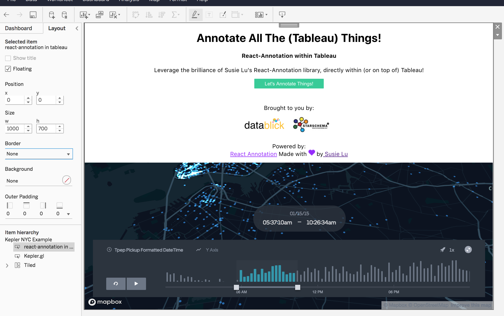
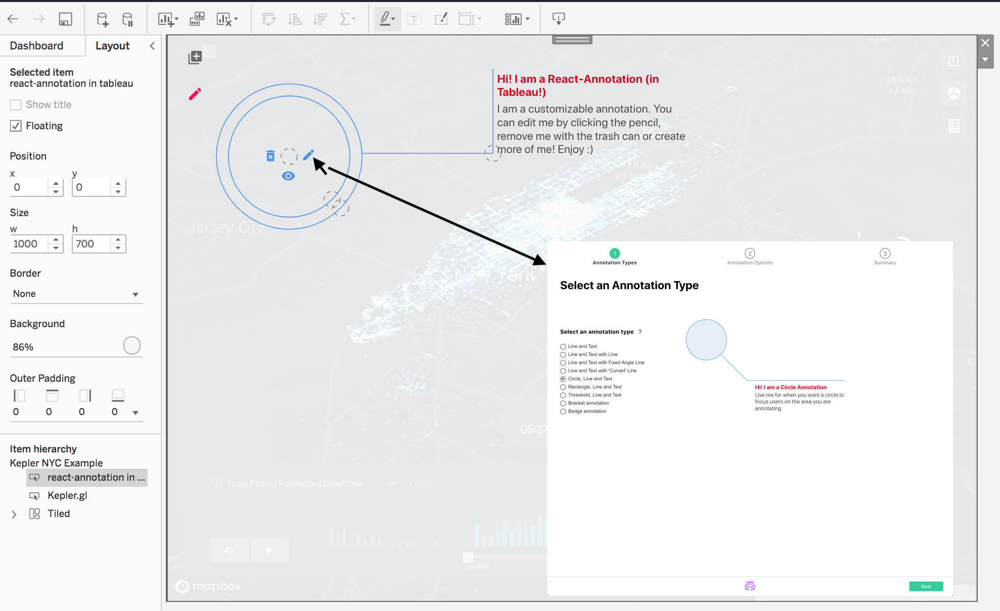
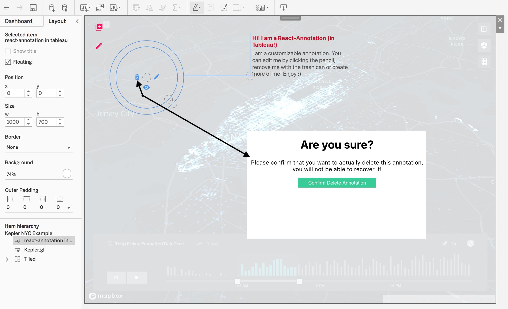
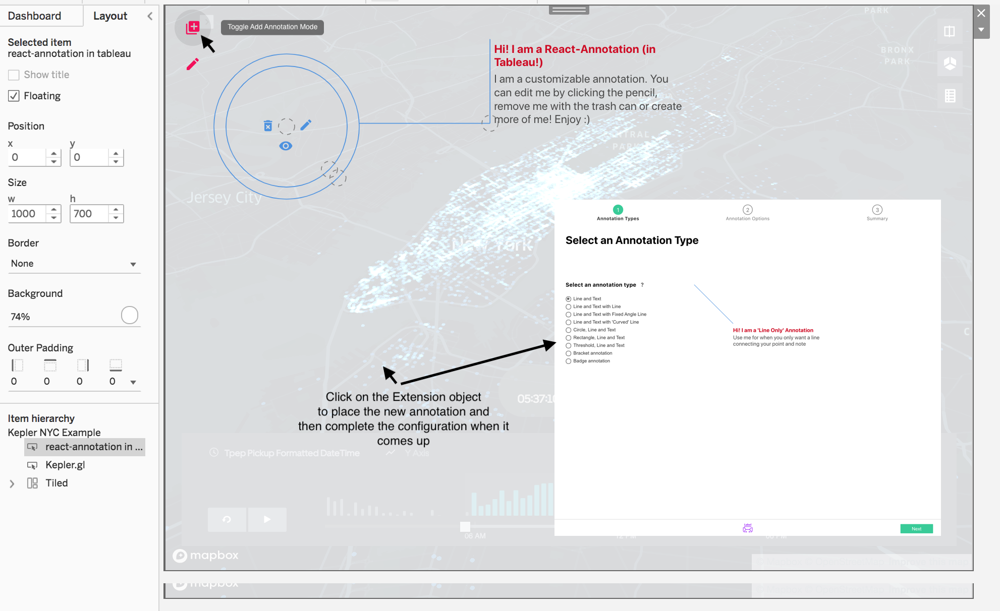

# Let's Annotate!
### Layering React Annotation on top of Tableau

## Introduction


This is the tableau extension that allows you to layer [Susie Lu's](https://twitter.com/datatoviz?lang=en) [react-annotation](https://react-annotation.susielu.com/) library on top of Tableau. When you add this to your dashboard (you will likely want to cover your entire dashboard with it) you can leverage the majority of annotation types and options available in [react-annotation](https://react-annotation.susielu.com/) directly within Tableau. We have built a simple configuration UI that you can take advantage of to be able annotate your viz to your heart's delight. 

## Env Requirements
version 1: Tableau Desktop >= 2018.2 and Tableau Server >= 2018.2, extension api v1.1+
version 1.1: Tableau Desktop & Server >= 2021.4, extension api v1.7+

This project was bootstrapped with [Create React App](https://github.com/facebook/create-react-app) along with [StarSchema](https://starschema.com/) & [DataBlick's](https://www.datablick.com/) **Tableau Extension Framework**.

## Quick Start
#### Step 1: Locate Annotate All The (Tableau) Things on the [Tableau Community Extensions](https://tableau.github.io/extensions-api/community/) page

Note: If you want the best experience, you should deploy a compiled version of this code directly to your Tableau Server and point your .trex file to that deployment of the extension. 

#### Step 2: Click ‘Allow’ to permit the extension to run.


#### Step 3a: Cover your Dashboard with the Extension Object. The best experience for now is to work with the extension using web edit on Tableau Server. Tableau Desktop is lacking transparency for Extension Objects. You are not required to cover your dashboard, but I found this the easiest way to use React Annotation across your viz. 

#### Step 3b: Click the `Let's Annotate!` button. 



#### Step 4: Edit the default annotation to your desire by clicking on the edit icon (pencil) and changing the many configurations. 

Note: You can reference the [react-annotation](https://react-annotation.susielu.com/) site for additional details and information on the configurations available to you.

Note: You may need to select "configure" again in the extension object menu if you do not see the edit icon and/or edit mode initially. 



#### Step 5: You can delete an annotation by clicking on the trash can icon and then confirming via the dialog box which pops up. 



Note: If you want to hide the annotation, but not delete it (e.g., save it for later, but don't show) you can click on the eyeball icon to toggle visibility of the annotation when not in Edit Mode. 

#### Step 6: You can add more annotations by toggling the icon on the top left and then clicking anywhere on the extension object's surface. Once the configuration pops up just fill it out and you will have a new annotation!



#### Step 7: Once you have added all of your annotations you can hide the ability to modify the annotations from the end user by toggling these two configurations in the add/edit annotation config. These settings are global and are accessed through the settings icon on the top left of the extension space.


* Show Controls - When no is selected the end user will not be able to toggle add/edit mode on as the icons on the top left will be hidden. This will also default to turning off add/edit mode. 

* Click Through Mode - As of extension api v1.7+ this leverages the [setClickThroughAsync](https://tableau.github.io/extensions-api/docs/interfaces/extensions.html#setclickthroughasync) api. It allows you to enable the end user to click through the extension layer and still interact with the Tableau Dashboard behind it. 

#### Step 8: If you want your changes to be retained, you **MUST** save your workbook before you close/exit Tableau. This will write the extension changes to your twb/twbx file. 

#### Step 9: If you want to see something different, submit an issue on this Github repo. 

## Local Development Setup
For a development installation (requires npm, node and yarn):

Install [node](https://nodejs.org/en/download/package-manager/) (`> 8.15.0`), [yarn](https://yarnpkg.com/en/docs/install). For best management of Node versions, use [nvm](https://github.com/creationix/nvm)
then simply run `nvm use 8`.

This project was bootstrapped with [Create React App](https://github.com/facebook/create-react-app) along with [StarSchema](https://starschema.com/) & [DataBlick's](https://www.datablick.com/) **Tableau Extension Framework**.

### Start local app
##### 1. Clone repo
```sh
git clone git@github.com:demartsc/tableau-react-annotation.git
```

##### 2. Install
```sh
yarn
# or
npm install
```

##### 3. Start local app session
```sh
yarn start
# or
npm run start
```

### Setup local extension in Tableau Desktop
##### 1. Launch Tableau
open tableau workbook (get it from public folder of this repo)
- NOTE: if you want to enable remote debugging, use this command in terminal to open tableau

```sh
open /Applications/Tableau\ Desktop\ 2019\.3.app --args --remote-debugging-port=8696
```

A debug session will be available in browser http://localhost:8696

##### 2. Execute extension in tableau

- copy the `datablick-react-annotation-local.trex` file (inside the `public` folder) into your `extensions` folder of the `My Tableau Repository` (likely in your `Documents` folder).

- Go to the Tableau window that opened when running the above command.

- Drag the extension onto dashboard and select the trex file from your my tableau repository\extensions folder.

- More information on [Tableau Extensions API](https://tableau.github.io/extensions-api/#) about [Get Started with Dashboard Extensions
](https://tableau.github.io/extensions-api/docs/trex_getstarted.html)

## Links
- [Susie Lu's](https://twitter.com/datatoviz?lang=en) [react-annotation](https://react-annotation.susielu.com/) library
